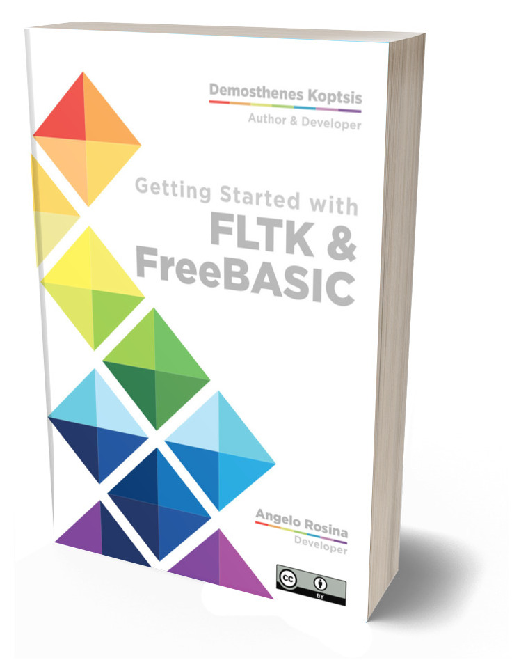

# Getting started with FLTK and FreeBASIC

This is the repository for the free book of FLTK and FreeBASIC.

With this book you will learn how to develop GUI applications with FLTK and FreeBASIC.

Due to Angelo Rosina the developer of FLTK headers for FreeBASIC and Demosthenes Koptsis the author of this book you can learn easily how to master FLTK headers with the facility of a BASIC language, the crossplatform FreeBASIC.

This repository will contain the pdf and odt files of the book and a number of example code which accompanies the book.

Thanks to [FLTK](https://www.fltk.org/) team, the [FreeBASIC](https://www.freebasic.net/) community and Angelo Rosina for supporting this work.
